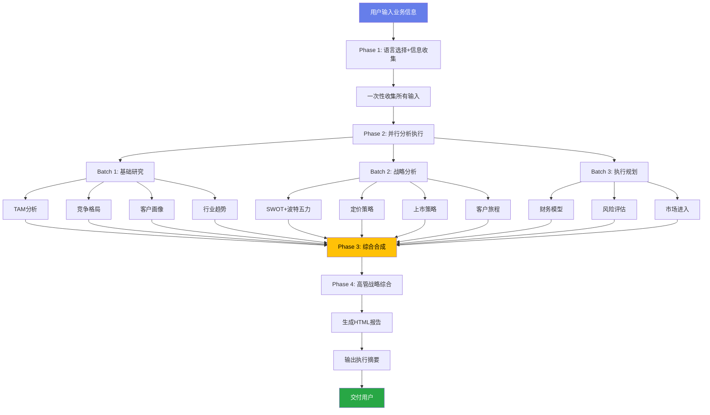

```mermaid
flowchart TD
    A[用户输入业务信息] --> B[Phase 1: 语言选择+信息收集]
    B --> C[一次性收集所有输入]
    C --> D[Phase 2: 并行分析执行]
    
    D --> E[Batch 1: 基础研究]
    D --> F[Batch 2: 战略分析]
    D --> G[Batch 3: 执行规划]
    
    E --> E1[TAM分析]
    E --> E2[竞争格局]
    E --> E3[客户画像]
    E --> E4[行业趋势]
    
    F --> F1[SWOT+波特五力]
    F --> F2[定价策略]
    F --> F3[上市策略]
    F --> F4[客户旅程]
    
    G --> G1[财务模型]
    G --> G2[风险评估]
    G --> G3[市场进入]
    
    E1 --> H[Phase 3: 综合合成]
    E2 --> H
    E3 --> H
    E4 --> H
    F1 --> H
    F2 --> H
    F3 --> H
    F4 --> H
    G1 --> H
    G2 --> H
    G3 --> H
    
    H --> I[Phase 4: 高管战略综合]
    I --> J[生成HTML报告]
    J --> K[输出执行摘要]
    K --> L[交付用户]
    
    style A fill:#667eea,color:#fff
    style L fill:#28a745,color:#fff
    style H fill:#ffc107,color:#000
```
